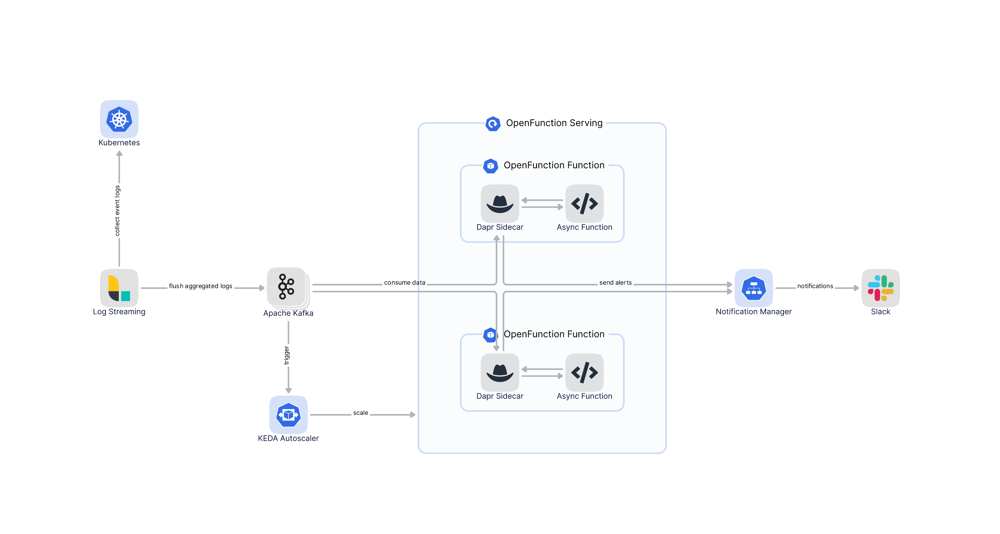

# Function Logs Handler

In this example, we'll use an async function to analyze the log stream in Kafka to find out the error logs. The async function will then send alerts to Slack. The entire workflow is like this:



For a detailed description of this function example, you can refer to the following blogs:

[OpenFunction 应用系列之一: 以 Serverless 的方式实现 Kubernetes 日志告警](https://kubesphere.io/zh/blogs/serverless-way-for-kubernetes-log-alert/)

or

[Serverless Use Case: Elastic Kubernetes Log Alerts with OpenFunction and Kafka](https://kubesphere.io/blogs/serverless-way-for-kubernetes-log-alert/)

## Prerequisites

Follow [this guide](../../../Prerequisites.md#openfunction) to install OpenFunction.

Follow [this guide](../../../Prerequisites.md#kafka) to install a Kafka server named `kafka-logs-receiver` and a Topic named `logs`.

Follow [this guide](../../../Prerequisites.md#registry-credential) to create a registry credential.

## Deployment

Create logs handler function:

```shell
kubectl apply -f logs-handler-function.yaml
```

The logs handler functions will be triggered by messages from the logs topic in Kafka.