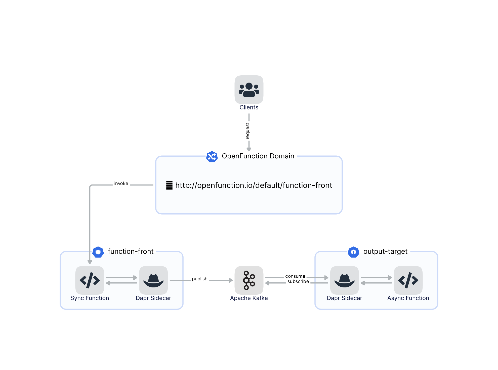
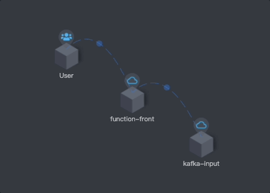
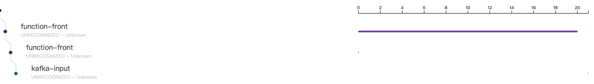
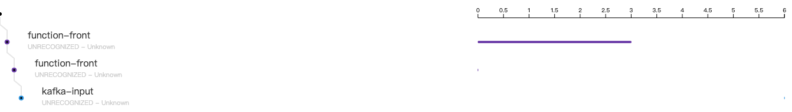

# Function tracing sample

It is well known that FaaS often blocks some of the underlying implementations for developers to allow them to focus on their business code. This makes it difficult to troubleshoot the service system. So we tried to introduce observable capabilities to OpenFunction to improve its usability and stability.

SkyWalking provides solutions for observing and monitoring distributed systems, in many different scenarios. 

We have now introduced SkyWalking (go2sky) for OpenFunction as a distributed tracing solution for Go language functions. We will demonstrate it in this sample.

## Prerequisites

The design of this sample is the same as sample [with-output-binding](https://github.com/OpenFunction/samples/blob/main/functions/knative/with-output-binding/README.md), but with some minor changes, which we will explain in the process.




Follow [this guide](https://github.com/OpenFunction/samples/blob/main/Prerequisites.md#openfunction) to install OpenFunction.

Follow [this guide](https://github.com/apache/skywalking-kubernetes#apache-skywalking-kubernetes) to install SkyWalking.

Follow [this guide](https://github.com/OpenFunction/samples/blob/main/Prerequisites.md#kafka) to install a Kafka server named `kafka-server` and a Topic named `sample-topic`.

Follow [this guide](https://github.com/OpenFunction/samples/blob/main/Prerequisites.md#registry-credential) to create a registry credential.

## Tracing parameters

| Name               | Description                                                  | Example                |
| ------------------ | ------------------------------------------------------------ | ---------------------- |
| enabled            | Switch for tracing, default to `false`                       | true, false            |
| provider.name      | Provider name can be set to "skywalking", "opentelemetry" (pending) | "skywalking"           |
| provider.oapServer | The oap server address                                       | "skywalking-opa:11800" |
| tags               | A collection of key-value pairs for Span custom tags in tracing |                        |
| tags.func          | The name of function. It will be automatically filled        | "function-a"           |
| tags.layer         | Indicates the type of service being tracked. It should be set to "faas" when you use the function | "faas"                 |
| baggage            | A collection of key-value pairs, exists in the tracing and also needs to be transferred across process boundaries |                        |

The following is a JSON formatted configuration reference that will guide the formatting structure of the tracing configuration:

```json
{
  "enabled": true,
  "provider": {
    "name": "skywalking",
    "oapServer": "skywalking-oap:11800"
  },
  "tags": {
    "func": "function-a",
    "layer": "faas",
    "tag1": "value1",
    "tag2": "value2"
  },
  "baggage": {
    "key": "key1",
    "value": "value1"
  }
}
```

## Deployment

First, we need to enable OpenFunction's tracing configuration.

We provide two ways to enable the function tracing capability:

> Here we assume that the skywalking-opa address in your cluster is `skywalking-opa.default:11800`

- Global configuration

  Modify the ConfigMap resource `openfunction-config` in the `openfunction` namespace.

  You should add `data.plugins.tracing` as follows:

  ```yaml
  data:
    plugins.tracing: |
      enabled: true
      provider:
        name: "skywalking"
        oapServer: "skywalking-oap:11800"
      tags:
        func: tracing-function
        layer: faas
        tag1: value1
        tag2: value2
      baggage:
        key: "key1"
        value: "value1"
  ```

> After API version v1beta2, the key changed to `data.tracing`.
  
- Function-level configuration

  With API version v1beta1, you should add `plugins.tracing` in the `metadata.annotations` in Function spec.

  ```yaml
  metadata:
    name: tracing-function
    annotations:
      plugins.tracing: |
        enabled: true
        provider:
          name: "skywalking"
          oapServer: "skywalking-oap:11800"
        tags:
          func: tracing-function
          layer: faas
          tag1: value1
          tag2: value2
        baggage:
          key: "key1"
          value: "value1"
  ```

  With API version v1beta2, you should set like this.

  ```yaml
  spec:
    serving:
      tracing: 
        enabled: true
        provider:
          name: "skywalking"
          oapServer: "skywalking-oap:11800"
        tags:
          func: tracing-function
          layer: faas
          tag1: value1
          tag2: value2
        baggage:
          key: "key1"
          value: "value1"
  ```

Then we can follow [this guide](https://github.com/OpenFunction/samples/blob/main/functions/knative/with-output-binding/README.md#deployment) (it recommends using the global tracing configuration, otherwise, you need to add function-level tracing configuration for both functions based on this sample) to deploy two functions for demonstrating the tracing effect of the entire link. 

## Result

Once it's all done, you can observe the flow of entire link on the SkyWalking UI.



We can also observe the comparison of the response time of the Knative runtime function (function-front) in the running state and under cold start:

In cold start:



In running:


